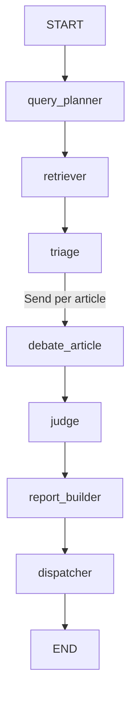

# Multi-Agent Deep Researcher — Implementation Plan

Build the system in `~/Outskill-Hackathon` (empty, dedicated hackathon folder) as the git-initialized project root. Stack per your choices: Python + LangGraph, OpenRouter as the single LLM gateway, Tavily for web search, Resend for email, Streamlit UI. Full end-to-end scope (all 10 agents, confidence scoring, report, email, UI).

## Key decisions (chosen, adjust if desired)
- **LLM gateway:** OpenRouter via `langchain-openai` `ChatOpenAI` (base_url `https://openrouter.ai/api/v1`). A single `llm(role)` router maps roles to model slugs so the doc's "deliberate heterogeneity" (§8) is real, not faked:
  - planner / glue / entailment: `meta-llama/llama-3.1-8b-instruct`
  - Perspective A & B (same model, differ only by prompt): `meta-llama/llama-3.3-70b-instruct`
  - Critical Analyst (different family): `mistralai/mistral-small-latest`
  - Judge (long context, reduce step): `google/gemini-2.0-flash-001`
  - fallback chain per role: primary → `google/gemini-2.0-flash-001` → `openai/gpt-4o-mini`
- **Retrieval:** Tavily (have key) as primary web search; arXiv, Semantic Scholar, Crossref, GDELT 2.0 need no key so wire them for real; `trafilatura` for full-text extraction. NewsAPI/Brave skipped (need keys not provided) — GDELT covers news + the "Indian sources" country filter.
- **Map-reduce:** LangGraph `Send` API for the per-article fan-out (verified current API), with `Annotated[list, operator.add]` reducers to collect parallel `ArticleAnalysis` results. Bounded re-retrieval (§3 dashed edge) implemented as a **1-shot internal loop inside the per-article debate node**, not a graph cycle — keeps the demo deterministic.
- **Persistence/demo:** SQLite checkpointer (`langgraph-checkpoint-sqlite`) for resume-after-crash; JSON cache keyed on `(topic, filter_hash)`; a `--replay` path that streams a cached run through the UI if wifi dies.

## Repo structure
```
Outskill-Hackathon/
  pyproject.toml            # deps + pinned versions
  .env.example              # OPENROUTER_API_KEY, TAVILY_API_KEY, RESEND_API_KEY, ...
  README.md
  src/deep_researcher/
    config.py               # settings from env
    state.py                # LangGraph ResearchState (TypedDict + reducers)
    models.py               # Pydantic contracts (§3)
    llm.py                  # llm(role) router + fallback + structured-output helper
    prompts.py              # all agent system prompts (§4, verbatim)
    scoring.py              # rubric total + noisy-OR aggregation + bands (§6)
    cache.py                # (topic, filter_hash) cache + replay
    graph.py                # StateGraph assembly, Send fan-out
    agents/
      query_planner.py  retriever.py  triage.py
      perspective.py    critical_analysis.py  judge.py
      report_builder.py dispatcher.py
    tools/
      search.py             # tavily/arxiv/s2/gdelt/crossref wrappers + fallback + cache
      extract.py            # trafilatura full-text + ~800-token/100-overlap chunking
    report/templates.py     # HTML (inline CSS, email-safe) + Markdown
  app/streamlit_app.py      # live agent-status board + report view + replay
  tests/                    # contract + scoring + graph smoke tests
  data/cache/               # cached runs
```

## Data contracts — `models.py` (§3)
Pydantic v2 models exactly matching the doc: `SearchQuery`, `FilterSpec`, `SearchPlan`, `Chunk`, `ArticleBundle`, `Claim`, `PerspectiveBrief`, `Contradiction`, `Flag`, `CritiqueReport`, `ArticleAnalysis` (bundle + brief A + brief B + critique), `ArticleVerdict`, `JudgedState`. Scoring components carry a required justification string so the schema rejects unjustified scores (§6).

`state.py` `ResearchState` (TypedDict) threads: `topic`, `filters`, `search_plan`, `raw_docs`, `bundles` (post-triage top-N), `analyses: Annotated[list[ArticleAnalysis], operator.add]` (map accumulator), `judged: JudgedState`, `report_md`, `report_html`, `delivery_status`, plus per-agent status flags for the UI.

## Graph topology — `graph.py`

- `TRI` uses `add_conditional_edges(triage, fan_out)` returning `[Send("debate_article", {"article": b}) for b in top_n]`.
- `debate_article` runs Advocate + Skeptic concurrently (`asyncio.gather`, blind to each other), then Critical Analysis; if `evidence_sufficiency == "insufficient"` and re-retry count `< 1`, does one targeted single-article re-retrieval and re-runs, then emits `{"analyses": [ArticleAnalysis]}`.
- `judge` runs once (superstep join) after all `debate_article` branches complete.
- Compile with SQLite checkpointer.

## Agents (each = one node module)
- **Query Planner** (`agents/query_planner.py`): topic+filters → `SearchPlan` (4–8 faceted queries incl. one mandated criticism-seeking query; filters → API params). Structured output.
- **Retriever** (`agents/retriever.py` + `tools/`): mostly deterministic tool-calling; executes plan across Tavily/arXiv/S2/GDELT/Crossref, `trafilatura` full-text (`full_text=false` when only abstract), chunk to `ArticleBundle`s with `{article_id}-c{n}` chunk_ids; never fabricates metadata. LLM used only for relevance sanity-check.
- **Triage & Dedup** (`agents/triage.py`): URL/title-cosine/wire-story dedup → `syndication_count`; cluster; rank relevance×recency×source-diversity; keep top-N (default 8) with `triage_rationale`.
- **Perspective A/B** (`agents/perspective.py`): Advocate + Skeptic, same model, prompt-differentiated, every claim cites chunk_ids, strength 1–5.
- **Critical Analysis** (`agents/critical_analysis.py`): citation entailment audit → `uncited_claims_rejected`; 3-type contradiction taxonomy; source validation; evidence sufficiency. Emits per-component scores (0–10 + justification) that scoring code consumes.
- **Judge / Synthesis** (`agents/judge.py`): resolve contradictions by type, `resolved_position` + `dissent_note`, per-article confidence via rubric, cross-source convergence/divergence synthesis, single-thread flags.
- **Report Builder** (`agents/report_builder.py` + `report/templates.py`): executive summary, key findings w/ confidence badges, preserved disagreements, per-article cards w/ visible rubric breakdown, methodology appendix; `[n]` citations → URLs; outputs `report.md` + email-safe `report.html`.
- **Dispatcher** (`agents/dispatcher.py`): deterministic — Resend send; on failure write `report.html` to `data/` and surface a local link; log `delivery_status` into state.

## Confidence scoring — `scoring.py` (§6)
- `confidence = Σ(componentᵢ × weightᵢ) × 10` with weights credibility .25 / evidence .25 / corroboration .20 / consistency .15 / recency .15; **LLM scores components, code computes total.**
- Finding-level noisy-OR with independence damping: `finding_conf = 1 − Π(1 − sᵢ·dᵢ)`, `dᵢ`=1.0 independent / 0.3 syndicated.
- Calibration bands (Strong/Moderate/Emerging/Weak) rendered in report.

## UI, reliability, config
- `app/streamlit_app.py`: input (topic + filters), live agent-status board driven by `graph.stream(...)` state updates (show the mutating typed state, then `uncited_claims_rejected`, then final report), and a `--replay`/toggle that streams a cached run.
- Reliability: 15s timeout + 1 retry on every API call; provider fallback behind `llm(role)`; every loop bounded; retrieval cache keyed on `(topic, filter_hash)`.
- `.env.example` + `README.md` with setup, run, and the two rehearsed demo topics; `config.py` reads keys and model-slug overrides.

## Verification
- Contract tests (Pydantic round-trip), scoring unit tests (rubric total + noisy-OR), and a graph smoke test on a tiny 2-article cached fixture so end-to-end runs offline. Manual end-to-end on the "Ozempic" walkthrough (§11).